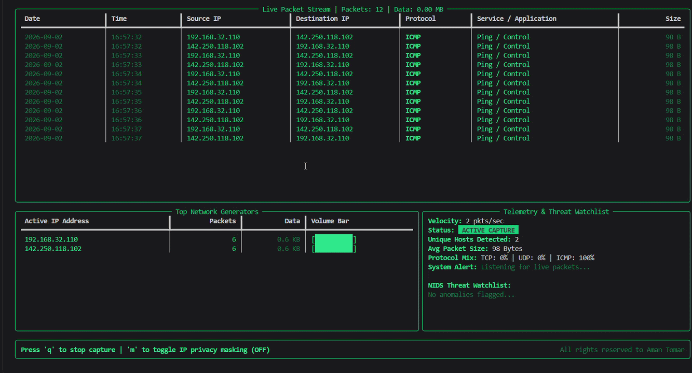

# 📡 Network Traffic Analyzer & Live Cyber Dashboard
A multi-threaded, real-time command-line network traffic analyzer and security telemetry dashboard built in Python using `Scapy` and `Rich`.

## ✨ Features
- **Live Packet Ingestion**: Asynchronous packet sniffing powered by `Scapy` with multi-protocol parsing (`TCP`, `UDP`, `ICMP`).
- **Real-time Telemetry Dashboard:** High-frequency UI rendering (4 FPS) showing packet throughput velocity, average packet size, and protocol mix ratios.
- **Top Network Generators:** Dynamic host analytics tracking top talkers by packet count and volume with visual volume bar graphs.
- **Threat Detection Watchlist:** Flags TCP SYN probes, cleartext HTTP/FTP/Telnet traffic, and non-standard high dynamic port connections (>1024) in real time for traffic anomaly detection.
- **Built-in Privacy Masking:** Press `m` inside the dashboard to toggle display-only IP masking — the network prefix stays visible while the host portion is blurred (e.g. `192.168.xxx.xxx`), so you can demo or record the dashboard publicly without exposing exact host addresses. This only affects what's drawn on screen; the underlying CSV/PCAP exports always retain full, unmasked addresses for forensic integrity.
- **Thread-Safe Architecture:** Uses explicit thread locking (`threading.Lock`) to prevent race conditions between background sniffing, calculation workers, and UI rendering loops.
- **Forensic Export Capability:** Non-blocking session capture logging with automated export to both a structured `.csv` audit log and a `.pcap` file for deep-dive inspection in Wireshark.
- Designed for low-level packet analysis, network velocity monitoring, host bandwidth tracking, and basic security threat inspection through an interactive Terminal User Interface (TUI).

---
<p align="center">
  
</p>


## 🛠️ Requirements & Dependencies

- **Python 3.8+** installed on your system.
- Elevated privileges (`sudo` on Linux/macOS or **Administrator** on Windows) are strictly required for raw socket binding
- Dependencies: `scapy`, `rich` (see `requirements.txt`)

## 📁 Project Layout

The tool is split into focused modules rather than one large script:

```
network_analyzer/
├── main.py         # Entry point: banner, thread startup, Live loop, save-on-exit prompt
├── config.py        # Static constants (known services, buffer limits)
├── state.py         # Shared mutable state + the thread lock
├── privileges.py     # Root/administrator privilege check
├── capture.py        # Scapy sniff callback, service resolution, capture + rate threads
├── detection.py      # Mini-NIDS alert rules
├── privacy.py         # Display-only IP masking helper
├── export.py          # CSV + PCAP session export
├── ui.py                # Rich dashboard layout + keyboard polling
└── requirements.txt
```

## 🚀 How to Run
1. **Clone or download this repository to your local machine:**
```
git clone https://github.com/aman-Tomar-30/Network-Traffic-Analyzer.git
cd Network-Traffic-Analyzer
```

2. Create a virtual environment (optional but recommended):
```
python3 -m venv venv
source venv/bin/activate  # On Windows use: venv\Scripts\activate
```

3. Install dependencies:
```
pip install -r requirements.txt
```

4. Run the analyzer with root/administrative privileges:
```
# On Linux / macOS
sudo python3 main.py

# On Windows (Run Command Prompt as Administrator)
python main.py
```

<br> 

5. Interactive Controls
- **Target IP Filtering:** At launch, enter a target IP address to isolate specific traffic, or press Enter to analyze all interface traffic.

- **Toggle Privacy Masking:** Press `m` inside the live dashboard to blur displayed IP host octets on/off. This is display-only — exported logs are never masked.

- **Graceful Exit:** Press `q` inside the live dashboard to stop capturing cleanly and restore terminal states.

- **Export Log:** Upon exit, choose `y` to save the full, unmasked session capture to a structured `.csv` file and a `.pcap` file.

## 🔬 Architecture Overview

The tool uses a non-blocking multi-threaded model to ensure high-speed network I/O never freezes the UI rendering pipeline. Every thread that touches shared state (`state.py`) does so behind a single `threading.Lock`:

```
                        ┌─────────────────────────────┐
                        │  Scapy Packet Sniffer Thread │
                        └───────────────┬─────────────┘
                                        │ (packet callback: capture.py)
                                        ▼
                        ┌─────────────────────────────┐
   ┌───────────────┐    │   Thread-Safe Shared State  │    ┌───────────────────────┐
   │ Rate Calc      │──►│   (state.py, state.lock)     │◄──│ Mini-NIDS Detection   │
   │ Thread (1 Hz)  │    └───────┬───────────────┬─────┘    │  Rules (detection.py) │
   └───────────────┘            │               │          └───────────────────────┘
                                 ▼               ▼
                  ┌───────────────────────┐   ┌───────────────────────────┐
                  │  Rich Terminal UI     │   │  On exit: CSV + PCAP      │
                  │  (ui.py, 4 FPS,       │   │  Export (export.py)       │
                  │  privacy.py masking)  │   │  — always unmasked        │
                  └───────────────────────┘   └───────────────────────────┘
```


## 🧠 Known Limitations & Future Scope
As a lightweight diagnostic tool, this script is optimized for immediate, short-term troubleshooting sessions (5–15 minutes).

- **Memory Optimization:** Currently, all packets are buffered in RAM to enable complete end-of-session CSV/PCAP exports. For extended capture sessions exceeding 100,000+ packets, future iterations will implement streaming buffers to log directly to disk.
- **IPv6 masking:** The privacy-masking feature currently only recognizes dotted-quad IPv4 addresses; IPv6 addresses are displayed unmasked.
- **Cross-session dedupe:** Repeated identical alerts within the same session are suppressed, but the watchlist doesn't persist across runs.

## 📄 Output Format (CSV Audit Log)
Exported `.csv` logs capture accurate, unmasked packet metadata for forensics (regardless of whether privacy masking was toggled on in the live UI):
```
| Date       | Time     | Source IP    | Destination IP | Protocol | Service             | Size (Bytes) |
| :---       | :---     | :---         | :---           | :---     | :---                | :---         |
| 2026-08-05 | 18:45:01 | 192.168.1.15 | 142.250.190.46 | TCP      | HTTPS (Web)         | 54 B         |
| 2026-08-05 | 18:45:02 | 192.168.1.1  | 192.168.1.15   | UDP      | DNS (Domain Lookup) | 78 B         |
```

A matching `.pcap` file is written alongside the CSV, containing the raw captured packets for direct import into Wireshark.


# 🌐 Networking Commands Lab

A collection of basic Linux networking commands for learning and testing common network protocols and services.

> **Note:** Run networking tests only on systems and networks you own or have permission to test.


## 📋 Contents

* [1. Ping](#1-ping)
* [2. FTP](#2-ftp)
* [3. DNS](#3-dns)
* [4. HTTPS](#4-https)
* [5. DHCP](#5-dhcp)
* [6. Telnet](#6-telnet)
* [7. NAT](#7-nat)
* [8. Useful Tools](#8-useful-tools)


## 1. Ping

**Ping** is used to test whether a host is reachable and to measure network latency.

### Command

```bash
ping google.com
```

Send a specific number of packets:

```bash
ping -c 4 google.com
```

### Example output

```text
4 packets transmitted, 4 received, 0% packet loss
rtt min/avg/max/mdev = 10.145/17.422/31.520/8.691 ms
```

### Useful options

```bash
ping -c 4 8.8.8.8
ping -c 10 google.com
```


## 2. FTP

**FTP (File Transfer Protocol)** is used to transfer files between a client and an FTP server.

### Connect to an FTP server

```bash
ftp 192.168.1.50
```

After connecting, common FTP commands include:

```text
ls              List files
pwd             Show current remote directory
cd folder       Change remote directory
lcd folder      Change local directory
get file.txt    Download a file
put file.txt    Upload a file
bye             Disconnect
```

### Download a file

```text
ftp> get file.txt
```

### Upload a file

```text
ftp> put file.txt
```

### Exit FTP

```text
ftp> bye
```

> **Note:** Traditional FTP is unencrypted. For secure file transfers, prefer SFTP or another encrypted protocol.


## 3. DNS

**DNS (Domain Name System)** translates domain names into IP addresses.

### Using `nslookup`

```bash
nslookup google.com
```

Query a specific DNS server:

```bash
nslookup google.com 8.8.8.8
```

### Using `dig`

```bash
dig google.com
```

Query Google's DNS server:

```bash
dig @8.8.8.8 google.com
```

### Reverse DNS lookup

```bash
nslookup 8.8.8.8
```

### Check configured DNS servers

```bash
cat /etc/resolv.conf
```


## 4. HTTPS

**HTTPS (HTTP Secure)** is HTTP transmitted over an encrypted TLS connection.

### Test an HTTPS website

```bash
curl https://google.com
```

### Display HTTP headers

```bash
curl -I https://google.com
```

### Display detailed connection information

```bash
curl -v https://google.com
```

`curl -v` can show details about the TCP connection, TLS negotiation, HTTP request, and server response.


## 5. DHCP

**DHCP (Dynamic Host Configuration Protocol)** automatically provides network configuration such as:

* IP address
* Subnet mask
* Default gateway
* DNS server
* Lease information

DHCP normally uses:

```text
UDP 67  → DHCP Server
UDP 68  → DHCP Client
```

### View network configuration

```bash
ip addr
```

View the routing table:

```bash
ip route
```

On systems using NetworkManager:

```bash
nmcli device status
```

### Capture DHCP traffic

```bash
sudo tcpdump -i any -n -vv 'udp port 67 or udp port 68'
```

In Wireshark, a useful display filter is:

```text
bootp
```

### DHCP DORA process

```text
Client                         DHCP Server

   |------ DHCP Discover -------->|
   |<------- DHCP Offer ----------|
   |------ DHCP Request --------->|
   |<------- DHCP ACK ------------|
```

**DORA = Discover → Offer → Request → Acknowledge**


## 6. Telnet

**Telnet** is a protocol for communicating with a remote system over TCP.

The standard Telnet port is:

```text
TCP 23
```

### Connect to a Telnet server

```bash
telnet 192.168.1.50 23
```

### Test a TCP service

For example:

```bash
telnet google.com 80
```

You can also use `nc` for simple TCP connectivity testing:

```bash
nc -vz 192.168.1.50 23
```

> **Security:** Telnet does not encrypt traffic. Avoid using it for real remote administration. Use SSH instead.


## 7. NAT

**NAT (Network Address Translation)** allows private IP addresses to communicate with external networks through a device such as a router.

### View your IP address

```bash
ip addr
```

### View the default gateway

```bash
ip route
```

Example:

```text
default via 192.168.1.1 dev eth0
```

### Check your public IP

```bash
curl https://api.ipify.org
```

### Capture network traffic

```bash
sudo tcpdump -i any -n
```

Generate some traffic:

```bash
curl https://example.com
```

### Basic NAT concept

```text
Private Network                 Internet

192.168.1.20:50000
        |
        |
        v
+----------------+
| Router / NAT   |
| 192.168.1.1    |
+----------------+
        |
        | Public IP
        v
     Internet
```

NAT translates the private source address/port into an address/port that can be routed on the external network.


## 8. Useful Tools

### Show network interfaces

```bash
ip addr
```

### Show routing table

```bash
ip route
```

### Test connectivity

```bash
ping 8.8.8.8
```

### DNS lookup

```bash
nslookup google.com
```

### Detailed DNS lookup

```bash
dig google.com
```

### HTTP/HTTPS client

```bash
curl -v https://example.com
```

### Test TCP ports

```bash
nc -vz 192.168.1.50 80
```

### Capture packets

```bash
sudo tcpdump -i any -n
```


## 📚 Protocol Quick Reference

| Protocol    | Purpose                         | Common Port |
| ----------- | -------------------------------- | ----------: |
| ICMP / Ping | Connectivity testing            |         N/A |
| FTP         | File transfer                   |      TCP 21 |
| DNS         | Domain name resolution          |  UDP/TCP 53 |
| HTTP        | Web traffic                     |      TCP 80 |
| HTTPS       | Encrypted web traffic           |     TCP 443 |
| DHCP        | Automatic network configuration |   UDP 67/68 |
| Telnet      | Remote terminal                 |      TCP 23 |
| NAT         | Address translation             |         N/A |


## 🛠️ Environment

These commands can be practiced on:

* Linux
* Ubuntu
* Debian
* Kali Linux
* WSL
* Virtual machines
* Personal/lab networks

Some commands may require `sudo` privileges.


## 📜 License

Copyright © 2026 Aman Tomar. All rights reserved.


## ⚠️ Disclaimer

This repository is intended for **educational purposes and authorized network testing**.

Do not use these commands to access, scan, intercept, or interfere with systems or networks without permission.


Happy networking! 🚀